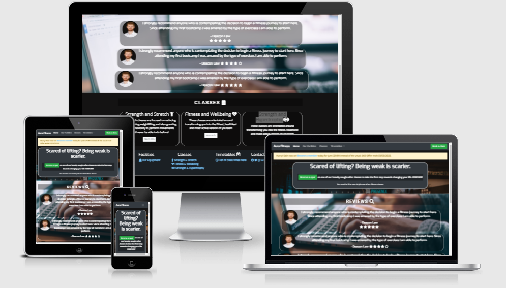

<h1 align="center">Aura Gym Website</h1>

[View the live project here.](https://j-cw.github.io/milestone-project-1/)

This is the main marketing website for Aura Gym. It is designed to be responsible and accessible on a range of devices, making it easy to navigate for potential gym-goers interested in beginning their fitness career through one of our classes.

<h2 align="center"></h2>

## User Experience (UX)

-   ### User stories

    -   #### First Time Visitor Goals

        1. As a First Time Visitor, I want to easily understand the main purpose of the site and learn more about the classes that are on offer.
        2. As a First Time Visitor, I want to be able to easily navigate throughout the site to find content.
        3. As a First Time Visitor, I want to look for testimonials/reviews to understand what their users think of them and see if they are trusted. I also want to locate their social media links to see their followings on social media to determine how trusted and known they are.

    -   #### Returning Visitor Goals

        1. As a Returning Visitor, I want to find information about any new up-and-coming classes they may decide to implement.
        2. As a Returning Visitor, I want to find the best way to get in contact with the gym with any questions I may have regarding equipment, etiquette etc.
        3. As a Returning Visitor, I want to find community links.

    -   #### Frequent User Goals
        1. As a Frequent User, I want to check to see if there are any newly added pieces of equipment.
        2. As a Frequent User, I want to check to see if there are any new changes to the opening times that may hinder my usual attendance timings.
        3. As a Frequent User, I want to follow their social media's to keep up to date and in the loop of the gym.

-   ### Design
    -   #### Colour Scheme
        -   The two main colours used are #78c6fc Blue and #1b2024 Grey.
    -   #### Typography
        -   The Exo font is the main font used throughout the whole website with Sans Serif as the fallback font in case for any reason the font isn't being imported into the site correctly. The Roboto font is also used for some headings just to add slight diversity and hopefully create a bold looking effect to emphasise the headings.
    -   #### Imagery
        -   Imagery is important. The background images surrounding the jumbotron as well as the background of the reviews container is designed to be striking and catch the user's attention. It also has a modern, energetic aesthetic which includes relevant images to the section they are currently reading.

*   ### Wireframes

    -   Home Page Wireframe - [View](/assets/images/index.html-wireframe.png)
        (copied this template for the other pages)

## Features

-   Responsive on all device sizes

-   Interactive elements which include a dropdown list within the navbar, a navbar that converts into a single dropdown menu on smaller devices, as well as a pop-up modal that appears when a user would like to book a class.

-   Client testimonials(reviews) which aid in informing potential new users of past customers that may have used the facilities on offer prior to them, allowing them to gauge an idea as to whether other people have enjoyed their experience. As a result, this establishes a potential trust within new users.

-   Downloadable timetables that allow users the ability to print off class times or just save them on their device, enabling ease of access.

-   Social media links are provided to grant users access to notifications of any updates made to the site or addition of any services that could interest them and or others.

## Technologies Used

### Languages Used

-   [HTML5](https://en.wikipedia.org/wiki/HTML5)
-   [CSS3](https://en.wikipedia.org/wiki/Cascading_Style_Sheets)

### Frameworks, Libraries & Programs Used

1. [Bootstrap 4.4.1:](https://getbootstrap.com/docs/4.4/getting-started/introduction/)
    - Bootstrap was used to assist with the responsiveness and styling of the website.
1. [Google Fonts:](https://fonts.google.com/)
    - Google fonts were used to import the 'Roboto' & 'Exo' fonts into the style.css file which are used on all pages throughout the project.
1. [Font Awesome:](https://fontawesome.com/)
    - Font Awesome was used on all pages throughout the website to add icons for aesthetic and UX purposes.
1. [jQuery:](https://jquery.com/)
    - jQuery came with Bootstrap to make the navbar responsive but was also used for the smooth scroll function in JavaScript.
1. [Git](https://git-scm.com/)
    - Git was used for version control by utilizing the Gitpod terminal to commit to Git and Push to GitHub.
1. [GitHub:](https://github.com/)
    - GitHub is used to store the projects code after being pushed from Git.
1. [Balsamiq:](https://balsamiq.com/)
    - Balsamiq was used to create the [wireframes](https://github.com/) during the design process.
1. [Google Dev:](https://developers.google.com/web/tools)
    - Google Dev Tools were used to improve the design of the site and as a means to experiment with implementing/altering elements/styling as well as providing a quick method to review the site on different device sizes and fit accordingly.

## Testing

### Manual Testing

   - Tested to see if the modal input fields ensures that a valid email address is inputted, as well as ensuring fields are not left empty.
   - Tested to see if the logo and other list elements in the nav + footer links to the correct place.
   - Tested to see if the Reviews section fits well on smaller devices - It did not so I decided to hide 2 of the 3 reviews to accomodate for spacing.
   - Tested to see if the initial decision of white text and image background was visually pleasing - It was not so decided to create a gradientDrk class to apply for any hard-to-read text.
   - 
The W3C Markup Validator and W3C CSS Validator Services were used to validate every page of the project to ensure there were no syntax errors in the project.

-   [W3C Markup Validator] Would not let me, gave me 503 Service Unavailable.
-   [W3C CSS Validator](https://jigsaw.w3.org/css-validator/#validate_by_input) - [Results](/assets/images/w3c-validator.png)

### Testing User Stories from User Experience (UX) Section

-   #### First Time Visitor Goals

    1. As a First Time Visitor, I want to easily understand the main purpose of the site and learn more about the facilities they offer.

        1. Upon entering the site, users are automatically greeted with a clean and easily readable navigation bar to go to the page of their choice. Underneath there is a callout that informs them of the current offer. 
        2. Users are then welcomed by a large callout section which contains a rhetorical question that provides them to make a choice between reading more about the facilities or not.
        3. The user has multiple options, either to immediately click 'reserve a spot' to send off a booking application or 'more info' on the relevant class(es) they may be interested in taking part.

    2. As a First Time Visitor, I want to easily be able to navigate throughout the site to find content.

        1. The site has been designed to be fluid and never to entrap the user. At the top of each page there is a clean navigation bar, each link describes what the page they will end up at clearly.
        2. At the bottom of the first 3 pages there is a call to action button to ensure the user always has ample opportunity to decide if they wish to attend the classes.
        3. If the user is unsure as to whether or not they are willing to attend, they can visit the facilities page which includes some photos of our facilities enabling them to gain a wider understanding of what we have to offer. Not only this, they are able to reach our social media pages through the footer links, or send us an email of which we will respond to any further questions/queries.

    3. As a First Time Visitor, I want to look for testimonials to understand what their users think of them and see if they are trusted. I also want to locate their social media links to see their following on social media to determine how trusted and known they are.
        1. The user can also scroll to the bottom of any page on the site to locate social media links in the footer.

-   #### Returning Visitor Goals

    1. As a Returning Visitor, I want to find the new classes or images of equipment that we have decided to implement, as well as potential updates to any timetables.

        1. These would be clearly shown within the alert bar, as well as 'NEW!' labels within the timetable navbar.
        2. They will be directed to the facilities page which will contain said photos of new equipment, or the classes page which would be updated with class info.

    2. As a Returning Visitor, I want to find the best way to get in contact with the organisation with any questions I may have.

        1. The navigation bar clearly highlights the "Our Facilities" Page.
        2. Here they can obtain our email or phone number/location on the map if they wish to attend in person.
        3. The footer contains links to the organisations Facebook, Twitter and Instagram page as well as the organization's email.
        4. Whichever link they click, it will be open up in a new tab to ensure the user can easily get back to the website.
        5. The email button is set up to automatically open up your email app and autofill there email address in the "To" section.

    3. As a Returning Visitor, I want to find the Facebook Group link so that I can join and interact with others in the community.
        1. The Facebook Page can be found at the footer of every page and will open a new tab for the user and more information can be found on the Facebook page.

-   #### Frequent User Goals

    1. As a Frequent User, I want to check to see if there are any newly added classes.

        1. The user would already be comfortable with the website layout and can easily click the alert message.

    2. As a Frequent User, I want to check to see if there are any changes to the timetables.

        1. The user would already be comfortable with the website layout and can easily click to view the up-to-date timetable.

### Further Testing

-   The Website was tested on Google Chrome, Internet Explorer, Microsoft Edge and Safari browsers.
-   The website was viewed on a variety of devices such as Desktop, Laptop, iPhone7, iPhone 8 & iPhoneX.
-   A large amount of testing was done to ensure that all pages were linking correctly.
-   Friends and family members were asked to review the site and documentation to point out any bugs and/or user experience issues.

### Known Bugs


## Deployment

### GitHub Pages

The project was deployed to GitHub Pages using the following steps...

1. Log in to GitHub and locate the [GitHub Repository](https://github.com/)
2. At the top of the Repository (not top of page), locate the "Settings" Button on the menu.
    - Alternatively Click [Here](https://raw.githubusercontent.com/) for a GIF demonstrating the process starting from Step 2.
3. Scroll down the Settings page until you locate the "GitHub Pages" Section.
4. Under "Source", click the dropdown called "None" and select "Master Branch".
5. The page will automatically refresh.
6. Scroll back down through the page to locate the now published site [link](https://github.com) in the "GitHub Pages" section.

### Forking the GitHub Repository

By forking the GitHub Repository we make a copy of the original repository on our GitHub account to view and/or make changes without affecting the original repository by using the following steps...

1. Log in to GitHub and locate the [GitHub Repository](https://github.com/)
2. At the top of the Repository (not top of page) just above the "Settings" Button on the menu, locate the "Fork" Button.
3. You should now have a copy of the original repository in your GitHub account.

### Making a Local Clone

1. Log in to GitHub and locate the [GitHub Repository](https://github.com/)
2. Under the repository name, click "Clone or download".
3. To clone the repository using HTTPS, under "Clone with HTTPS", copy the link.
4. Open Git Bash
5. Change the current working directory to the location where you want the cloned directory to be made.
6. Type `git clone`, and then paste the URL you copied in Step 3.

```
$ git clone https://github.com/YOUR-USERNAME/YOUR-REPOSITORY
```

7. Press Enter. Your local clone will be created.

```
$ git clone https://github.com/YOUR-USERNAME/YOUR-REPOSITORY
> Cloning into `CI-Clone`...
> remote: Counting objects: 10, done.
> remote: Compressing objects: 100% (8/8), done.
> remove: Total 10 (delta 1), reused 10 (delta 1)
> Unpacking objects: 100% (10/10), done.
```

Click [Here](https://help.github.com/en/github/creating-cloning-and-archiving-repositories/cloning-a-repository#cloning-a-repository-to-github-desktop) to retrieve pictures for some of the buttons and more detailed explanations of the above process.

## Credits

### Code

-   The full-screen hero image code came from this [StackOverflow post](https://stackoverflow.com)

-   [Bootstrap4](https://getbootstrap.com/docs/4.4/getting-started/introduction/): Bootstrap Library used throughout the project mainly to make site responsive using the Bootstrap Grid System.

-   [MDN Web Docs](https://developer.mozilla.org/) : For Pattern Validation code. Code was modified to better fit my needs and to match an Irish phone number layout to ensure correct validation. Tutorial Found [Here](https://developer.mozilla.org/en-US/docs/Web/HTML/Element/input/tel#Pattern_validation)

### Content

-   All content was written by the developer.


### Media

-   All Images were created by the developer.

### Acknowledgements

-  My fellow students on slack.